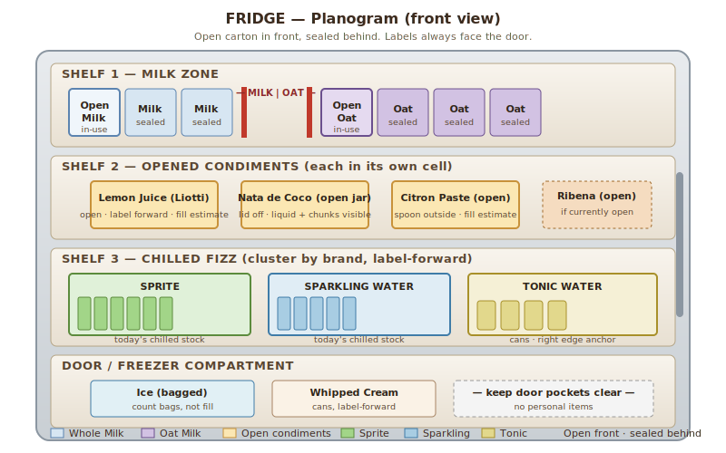
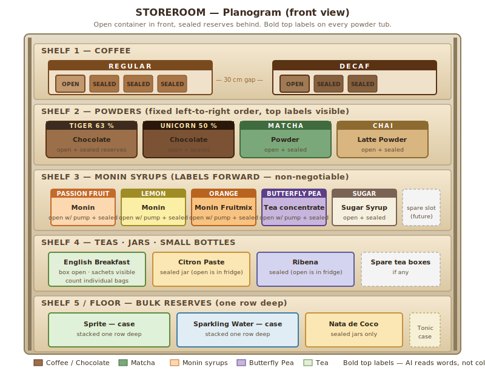

# Planogram Arrangement Guide — RLC Café

A practical layout for the fridge and storeroom that maximises AI vision counting accuracy. Designed to be set up in **5 minutes** before service and maintained automatically as volunteers grab and replace items.

Two principles drive every rule below:

1. **The AI counts what it can see and label.** Hidden items don't exist. Unlabeled items are guesses.
2. **Consistency beats cleverness.** The same arrangement every Sunday lets the reference photo do its job.

---

## 1. Inventory at a glance

| Location | Item | Form | Counting style |
|---|---|---|---|
| **FRIDGE** | Milk (Fresh) | 1 L cartons | Whole units + 1 open |
| **FRIDGE** | Lemon Juice (Liotti) | bottle | Whole units + 1 open (fill level) |
| **FRIDGE** | Ice | bag/tray | Bags or fill level |
| **STOREROOM** | Oat Milk | 1 L cartons | Whole units + 1 open |
| **STOREROOM** | Sprite | bottles | Whole units + 1 open |
| **STOREROOM** | Sparkling Water | bottles | Whole units + 1 open |
| **STOREROOM** | Tonic Water | cans/bottles | Whole units + 1 open |
| **STOREROOM** | Nata de Coco | jar/box | Sealed jars + 1 open (fill level) |
| **STOREROOM** | Coffee Beans | sealed bags | Bags + 1 open (fill level) |
| **STOREROOM** | Decaf Coffee Beans | sealed bags | Bags + 1 open (fill level) |
| **STOREROOM** | Chocolate Powder (63% Tiger) | bag/tub | Sealed + 1 open (fill level) |
| **STOREROOM** | Chocolate Powder (50% Unicorn) | bag/tub | Sealed + 1 open (fill level) |
| **STOREROOM** | Matcha Powder | bag/tub | Sealed + 1 open (fill level) |
| **STOREROOM** | Chai Latte Powder | bag/tub | Sealed + 1 open (fill level) |
| **STOREROOM** | Monin Passion Fruit Syrup | bottle | Sealed + 1 open (fill level) |
| **STOREROOM** | Monin Lemon Syrup | bottle | Sealed + 1 open (fill level) |
| **STOREROOM** | Monin Orange Fruitmix | bottle | Sealed + 1 open (fill level) |
| **STOREROOM** | Butterfly Pea Tea | jar/bottle | Sealed + 1 open (fill level) |
| **STOREROOM** | Sugar Syrup | bottle | Whole + 1 open |
| **STOREROOM** | English Breakfast Tea | tea bags | Count individual sachets |
| **STOREROOM** | Citron Paste | jar | Sealed + 1 open (fill level) |
| **STOREROOM** | Ribena | bottle | Sealed + 1 open (fill level) |

The pattern across the inventory is: **one open item in active use + a small reserve of sealed units**. The arrangement preserves that pattern visually so the AI can count both states distinctly.

---

## 2. Fridge layout



<details>
<summary>Text-only diagram (for accessibility / terminals)</summary>

```
┌──────────────────────────────────────────────────────────┐
│                       FRIDGE FRONT                        │
├──────────────────────────────────────────────────────────┤
│ TOP SHELF — MILK ZONE                                    │
│                                                          │
│   [Open Milk]   [Sealed Milk]  [Sealed Milk]             │
│    ↑label       ↑label          ↑label                   │
│    (front)      (behind)        (behind)                 │
│                                                          │
│   [Open Oat]    [Sealed Oat]   [Sealed Oat]              │
│    ↑label       ↑label          ↑label                   │
│                                                          │
│   ── divider tape: "MILK | OAT" ──                       │
├──────────────────────────────────────────────────────────┤
│ MIDDLE SHELF — IN-USE OPEN ITEMS                         │
│                                                          │
│   [Lemon Juice  ]  [Nata de Coco ]  [Citron Paste ]      │
│   [open, label  ]  [open jar     ]  [open jar     ]      │
│   [forward      ]  [lid OFF if   ]  [lid OFF if   ]      │
│                    [scoop in use ]  [scoop in use ]      │
│                                                          │
│   Each item in its own square (use shelf liner grid)     │
├──────────────────────────────────────────────────────────┤
│ BOTTOM SHELF — CHILLED FIZZ (today's service stock)      │
│                                                          │
│   ┌─SPRITE──────┐  ┌─SPARKLING──┐  ┌─TONIC──────┐        │
│   │ ▌ ▌ ▌ ▌ ▌ ▌ │  │ ▌ ▌ ▌ ▌ ▌ │  │ ▌ ▌ ▌ ▌    │        │
│   │ labels →    │  │ labels →   │  │ labels →   │        │
│   └─────────────┘  └────────────┘  └────────────┘        │
│                                                          │
│   Stand bottles upright. Cans label-forward in rows.     │
├──────────────────────────────────────────────────────────┤
│ DOOR / FREEZER COMPARTMENT                               │
│                                                          │
│   [Ice bags — count visible bags]                        │
│   [Whipped cream cans, if any]                           │
└──────────────────────────────────────────────────────────┘
```

</details>

### Why this layout

- **Top shelf is milk only.** Milk and oat milk are the two highest-confusion items. Each gets its own dedicated row, separated by a strip of bright tape labelled "MILK | OAT". The AI only has to ask "is this row left or right of the divider" to disambiguate.
- **Open carton always front-left of its row.** That position is the "currently in use" slot. The AI sees one front carton with maybe a different cap colour or fill weight and learns to count it as the open unit.
- **Middle shelf groups opened condiments** (lemon juice, nata de coco, citron paste). These are all transparent or semi-transparent — the AI estimates fill level. Keep them widely spaced so each occupies its own visual cell.
- **Bottom shelf is fizz** — Sprite, Sparkling Water, Tonic. Cluster by brand, all labels forward. Sprite and Sparkling Water are the most visually similar; Tonic is usually a smaller can/different shape, so put Tonic on the right edge.
- **Door / freezer for ice.** Ice is hard to count in a tray; bagged ice in the freezer is far easier. If you can't bag it, don't try to count it from the photo — just record manually in the post-AI edit step.

---

## 3. Storeroom layout



<details>
<summary>Text-only diagram (for accessibility / terminals)</summary>

```
┌──────────────────────────────────────────────────────────┐
│                    STOREROOM SHELVING                     │
├──────────────────────────────────────────────────────────┤
│ SHELF 1 (TOP) — COFFEE                                   │
│                                                          │
│   ┌─REGULAR──────┐         ┌─DECAF────────┐              │
│   │ [open bag]   │         │ [open bag]   │              │
│   │ [sealed]     │         │ [sealed]     │              │
│   │ [sealed]     │         │              │              │
│   └──────────────┘         └──────────────┘              │
│                                                          │
│   Big handwritten signs: "REGULAR" / "DECAF"             │
│   Open bag stands UPRIGHT with clip — easy fill estimate │
├──────────────────────────────────────────────────────────┤
│ SHELF 2 — POWDERS (the lookalikes)                       │
│                                                          │
│   [Choc 63%   ]  [Choc 50%   ]  [Matcha     ]  [Chai    ]│
│   [Tiger      ]  [Unicorn    ]  [Powder     ]  [Latte   ]│
│   [BROWN      ]  [BROWN      ]  [GREEN      ]  [BEIGE   ]│
│                                                          │
│   Bold black marker label on top of every tub:           │
│   "TIGER 63" / "UNICORN 50" / "MATCHA" / "CHAI"          │
│   Open container in front. Sealed reserves behind.       │
├──────────────────────────────────────────────────────────┤
│ SHELF 3 — MONIN SYRUPS (label-forward critical)          │
│                                                          │
│   [Passion ] [Lemon  ] [Orange ] [Butterfly] [Sugar  ]   │
│   [orange  ] [yellow ] [orange ] [Pea purple] [clear  ]  │
│   [front   ] [front  ] [front  ] [front     ] [front  ]  │
│                                                          │
│   ALL Monin bottles same shape — labels MUST face camera │
│   Open bottle (with pump) front of pair, sealed behind.  │
├──────────────────────────────────────────────────────────┤
│ SHELF 4 — TEAS, JARS, SMALL BOTTLES                      │
│                                                          │
│   [English   ]  [Citron     ]  [Ribena     ]  [Spare   ] │
│   [Breakfast ]  [Paste jar  ]  [bottle     ]  [tea     ] │
│   [box       ]  [(sealed)   ]  [             ]  [boxes   ]│
│                                                          │
│   Tea box OPEN with sachets visible — AI counts sachets  │
├──────────────────────────────────────────────────────────┤
│ SHELF 5 / FLOOR — BULK RESERVES                          │
│                                                          │
│   [Sprite case]  [Sparkling case]  [Tonic case]          │
│   [Nata jars  ]  [Open: NONE — all open jars in fridge]  │
│                                                          │
│   Stack one row deep. If second row needed, take a       │
│   second photo at angle.                                 │
└──────────────────────────────────────────────────────────┘
```

</details>

### Why this layout

- **Coffee at the top, separated regular vs decaf.** Decaf is currently low-volume but easy to mistake for regular. Physical separation by ~30 cm prevents the AI from grouping them.
- **Powders shelf is the highest-risk shelf.** Four similar tubs in a row. Defenses:
  - Bold top labels (`TIGER 63`, `UNICORN 50`, `MATCHA`, `CHAI`) so the AI reads the word, not the colour.
  - Fixed left-to-right order: chocolate → chocolate → matcha → chai. Volunteers must replace into the same slot.
  - Houjicha (discontinuing) gets removed from the planogram entirely once stock is gone.
- **Monin syrups always label-forward.** Three Monin bottles look nearly identical from the side. The label is the only signal. Use a piece of tape on the shelf with arrows pointing forward to remind volunteers.
- **Open vs sealed on the same row.** Open bottle/tub front-and-centre, sealed reserves behind. The reference photo captures this layering, and the AI is prompted to estimate fill level for the front item and count whole units for the rest.
- **Bulk reserves on the floor / lowest shelf.** Cases of bottles are visually dense and easy to count if stacked one row deep. If you must double-row, take a second photo of the back row.

---

## 4. Setup checklist (5 min, every Sunday before opening)

- [ ] **Fridge**
  - [ ] Milk and oat milk in their dedicated rows, divider tape visible
  - [ ] Open carton at front-left of each row, sealed behind, all labels facing forward
  - [ ] Lemon juice / nata / citron in their three middle-shelf cells, lids on or off consistently with what's actually in use
  - [ ] Sprite / Sparkling / Tonic clustered by brand, label-forward
  - [ ] No items in the door pockets except ice and whipped cream
- [ ] **Storeroom**
  - [ ] Coffee bags clipped upright (open) or laid flat (sealed); REGULAR | DECAF signs visible
  - [ ] All four powder tubs in fixed left-to-right order with top labels visible
  - [ ] All five Monin/Sugar bottles label-forward; pump fitted to the open one
  - [ ] Open tea box has sachets visible; lid off or angled open
  - [ ] No second-row stacking unless you take a second photo
- [ ] **Both**
  - [ ] Wipe shelf liner — fingerprints and condensation hurt vision OCR
  - [ ] Remove anything that isn't on the inventory list (personal water bottles, etc.) — the AI will flag those as "unknown"

---

## 5. Taking the reference photo (one-time, then update if layout changes)

The reference photo is what the AI compares the live photo against. Get this right and every weekly count gets easier.

**Lighting**
- Open the fridge / storeroom door fully. Use the room's main lights, not the fridge interior bulb (creates harsh shadows).
- If the fridge is dim, hold the phone torch about 1 m away from another angle (not straight-on — that creates glare on labels). One person holds, one shoots.
- Avoid taking the photo against a window — backlight blows out the shelves.

**Distance and framing**
- Stand **about 1 metre back** for a fridge — close enough that you can read every label by eye in the preview, far enough that one frame captures all shelves top to bottom.
- For the storeroom, take **one frame per shelf** if the unit is taller than ~1.5 m. The AI accepts up to 3 photos. Use shelf 1+2 in one shot, shelf 3+4 in another, shelf 5 separately if needed.
- **Phone held landscape**, not portrait. Wider field of view, less perspective distortion.
- Keep the phone parallel to the shelf face. Tilting introduces perspective skew that makes label OCR harder.

**Composition**
- Centre the camera on the middle shelf. Shelves above and below get distorted but remain readable.
- Every label that you'll later count must be **legible at 100 % zoom on your phone screen**. If a label is blurry on your screen, it's invisible to the AI.
- Capture a small amount of empty shelf around the items — gives the AI spatial reference for "this row is for X".

**One-time setup procedure**
1. Stage the layout exactly as described above. Open bottle in the open slot, sealed in the reserve slot, labels forward, divider tape in place.
2. Take 2-3 candidate photos.
3. Pick the one where every label is clearly readable when you zoom in.
4. Upload via Admin → Planogram → Upload Reference (fridge / storeroom).
5. Re-take only if you change the physical arrangement (e.g., add a new ingredient).

---

## 6. Weekly stock-count photo (~30 seconds)

1. Set the fridge / storeroom to its baseline arrangement (any service-day disruption fixed).
2. Open the POS → Stock Count → choose Fridge or Storeroom.
3. Take **1-3 photos** in the same framing as the reference photo. Same distance, same angle.
4. Tap Analyze. The AI returns a draft count.
5. **Skim the results.** Adjust any obviously wrong numbers (especially `low` confidence rows).
6. Tap Confirm.

If a row shows confidence 🔴 (low), the AI is telling you it couldn't see the item clearly. That's almost always a layout issue — item turned, blocked by another item, label not facing forward. Note which item, fix it next week.

---

## 7. Items the AI struggles with — and what saves them

| Item | Why it's hard | Layout defence |
|---|---|---|
| Whole Milk vs Oat Milk cartons | Same size cartons, similar branding | Dedicated rows + divider tape; open carton always front-left |
| The three Monin syrups | Identical bottles, only label differs | Strict label-forward rule + fixed left-to-right order on the syrup shelf |
| Chocolate Tiger 63 % vs Unicorn 50 % | Both brown chocolate-powder tubs | Big handwritten top labels (`TIGER 63`, `UNICORN 50`); never adjacent if avoidable |
| Sealed Coffee vs Decaf bags | Same vendor packaging | Physical separation by 30+ cm; large signs |
| Open syrup fill levels | Liquid level under reflective glass | Always open bottles **upright** and label-forward; the back of the bottle reflects less |
| Sparkling Water vs Sprite cans | Both clear-cap fizzy bottles, similar size | Cluster by brand, never interleave; Tonic on the right edge as a visual anchor |
| Ice in the tray | Frost obscures fill level | Use bagged ice in freezer instead — count bags, not fill |
| Tea sachets in an open box | Easy to miscount if jumbled | Stand sachets upright in a row when possible; lid open at 90° |
| Houjicha (discontinuing) | Yet another brown powder | **Remove from the shelf** once stock = 0; don't keep an empty tub there |
| Nata de coco fill in jar | Liquid + chunks, transparent | Always store the open jar with label forward and lid removed (or upside-down beside it) so the contents are visible |
| Anything in a stacked second row | Hidden by the front row | Take a second photo at a side angle. If you can't, mark it on a sticker on the shelf — "5 here, hidden" — and edit after the AI pass |

---

## 8. When to update the reference photo

Re-upload the reference photo when:

- An ingredient is added (e.g., a new syrup arrives).
- An ingredient is permanently removed (e.g., houjicha is gone).
- The shelf positions change for any reason.
- AI confidence on a particular row stays 🔴 for 2+ weeks despite the layout looking correct — the lighting or angle in the reference may be off.

A new reference takes ~2 minutes. Don't refresh it for a one-week disruption (e.g., a special event with extra stock crammed in temporarily) — just edit the AI's count manually that week.

---

## 9. Quick reference — the rules that matter most

1. **Labels forward, always.** Especially Monin syrups, milks, and powders.
2. **Open in front, sealed behind.** Same item, two states; the AI handles them differently.
3. **One row, one item type.** Don't mix Sprite and Sparkling in the same row.
4. **Same place, every Sunday.** The reference photo expects it.
5. **Three photos max** — fridge usually needs one, storeroom often two, never more than three.
6. **Edit the count if the AI is wrong.** That's why the Confirm step shows numeric inputs — trust your eyes over the model when they disagree.
