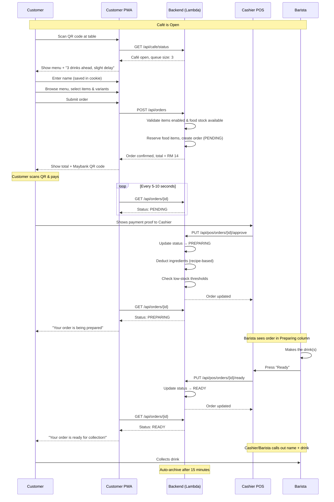

# User Journey — Order to Collection

```mermaid
sequenceDiagram
    participant C as Customer
    participant App as Customer PWA
    participant API as Backend (Lambda)
    participant POS as Cashier POS
    participant B as Barista

    Note over C,B: Café is Open

    C->>App: Scan QR code at table
    App->>API: GET /api/cafe/status
    API-->>App: Café open, queue size: 3
    App-->>C: Show menu + "3 drinks ahead, slight delay"

    C->>App: Enter name (saved in cookie)
    C->>App: Browse menu, select items & variants
    C->>App: Submit order

    App->>API: POST /api/orders
    API->>API: Validate items enabled & food stock available
    API->>API: Reserve food items, create order (PENDING)
    API-->>App: Order confirmed, total = RM 14

    App-->>C: Show total + Maybank QR code
    Note over C: Customer scans QR & pays

    loop Every 5-10 seconds
        App->>API: GET /api/orders/{id}
        API-->>App: Status: PENDING
    end

    C->>POS: Shows payment proof to Cashier

    POS->>API: PUT /api/pos/orders/{id}/approve
    API->>API: Update status → PREPARING
    API->>API: Deduct ingredients (recipe-based)
    API->>API: Check low-stock thresholds
    API-->>POS: Order updated

    App->>API: GET /api/orders/{id}
    API-->>App: Status: PREPARING
    App-->>C: "Your order is being prepared"

    Note over POS,B: Barista sees order in Preparing column

    B->>B: Makes the drink(s)
    B->>POS: Press "Ready"

    POS->>API: PUT /api/pos/orders/{id}/ready
    API->>API: Update status → READY
    API-->>POS: Order updated

    App->>API: GET /api/orders/{id}
    API-->>App: Status: READY
    App-->>C: "Your order is ready for collection!"

    Note over POS,B: Cashier/Barista calls out name + drink

    C->>B: Collects drink

    Note over API: Auto-archive after 15 minutes
```
